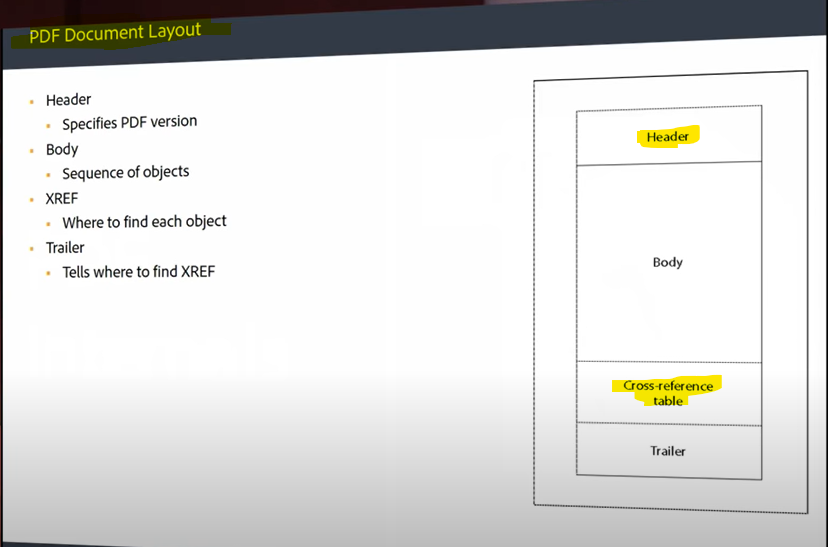
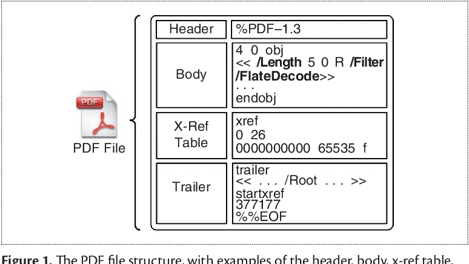

# Explore

### What is Latex?
LaTeX is a software system for document preparation. When writing, the writer uses plain text as opposed to the formatted text found in WYSIWYG word processors like Microsoft Word, LibreOffice Writer and Apple Pages. 

### How do I create a pdf file from scratch?
Open a texteditor (Notepad for windows) and paste the following code and give a file and save as a pdf file (.pdf at the end of the file)

```
%PDF-1.0
%âãÏÓ
1 0 obj
<<
/Kids [2 0 R]
/Count 1
/Type /Pages
>>
endobj
2 0 obj
<<
/Rotate 0
/Parent 1 0 R
/Resources 3 0 R
/MediaBox [0 0 612 792]
/Contents [4 0 R]
/Type /Page
>>
endobj
3 0 obj
<<
/Font
<<
/F0
<<
/BaseFont /Times-Italic
/Subtype /Type1
/Type /Font
>>
>>
>>
endobj
4 0 obj
<<
/Length 65
>>
stream
1. 0. 0. 1. 50. 700. cm
BT
 /F0 36. Tf
 (Hello, Student!) Tj
ET
endstream
endobj
5 0 obj
<<
/Pages 1 0 R
/Type /Catalog
>>
endobj xref
0 6
0000000000 65535 f
0000000015 00000 n
0000000074 00000 n
0000000192 00000 n
0000000291 00000 n
0000000409 00000 n
trailer
<<
/Root 5 0 R
/Size 6
>>
startxref
459
%%EOF
```

Open the file just create with any pdf reader or using with your browser. (just drag the file over to your browser)
Thats it, now you can see a pdf file with `Hello, Student!` text.

### Hex dump
In computing, a hex dump is a hexadecimal view of computer data, from memory or from a computer file or storage device. Looking at a hex dump of data is usually done in the context of either debugging or reverse engineering. In a hex dump, each byte is represented as a two-digit hexadecimal number.

You can examine any file with a utility called xxd.exe program, you can get it [here](./xxd.exe) or build it by your own [from](https://github.com/mateors/xxd)

Syntax to examin any file using xxd:
```
Syntax: xxd <fileName>
Example: xxd hello.pdf
```






## Resource
* [Download the latest latex compiler](https://miktex.org)
* [Pdf File Format](https://resources.infosecinstitute.com/topic/pdf-file-format-basic-structure)
* [PDF Document Structure](https://www.oreilly.com/library/view/pdf-explained/9781449321581/ch04.html)
* [Pdf objects are broken down and highlighted](https://docs.google.com/document/d/1jgN43m-sJuC6Gnv6ZjKvyucG0QE5DeRHK_pu1rP7is8/edit?usp=sharing)
* [Pdf Internals](https://youtu.be/KmP7pbcAl-8?list=PLfGR40SWnakiUvTrdbTajYZsBAVvonb5y)